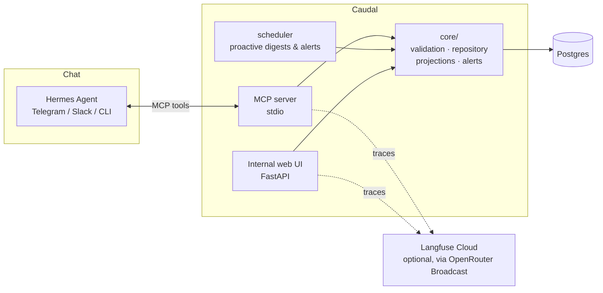

# Caudal

[](https://github.com/RookieCol/caudal/actions/workflows/ci.yml)
[](pyproject.toml)
[](LICENSE)

**Ask, don't guess.**

**Caudal** (Spanish: both *water flow* and *wealth*) — the finance OS for a bootstrapped SaaS: an [MCP](https://modelcontextprotocol.io) server that turns a chat conversation into structured income/expense records, plus an internal web UI and a proactive projections/alerting engine.

> The Python package keeps its original name (`finance_mcp`) — the repo and product are Caudal.

## What this is

The primary interaction surface is chat: a message like *"pagué 50 dólares a AWS ayer"* should end up as a structured, validated transaction in Postgres. The chat side is handled by [Hermes Agent](https://github.com/NousResearch/hermes-agent) — this repo doesn't build a chatbot, it builds the **tool Hermes calls**.

- Money is stored as integer minor units (never floats), every write is idempotent and audit-logged.
- **Single-currency ledger by construction:** USD amounts are converted to COP at the official daily TRM (Banco de la República, via datos.gov.co) at record time (`core/fx.py`) — aggregates never mix currencies.
- Beyond recording what happened, the system computes forward-looking **projections** (cash-flow, runway, MRR) and runs a **proactive alert engine** (budget overruns, runway thresholds) on a schedule.
- Ships with CI, structured logging/tracing/metrics, backups, and a tested restore path — production hygiene, not a script.

Domain background (SaaS accounting fundamentals, category taxonomy, metric formulas) lives in [`finanzas-saas.md`](../finanzas-saas.md).

**Why MCP, not A2A**: Hermes has no Google A2A support but has first-class MCP client support, and MCP's **elicitation** capability (`elicitation/create`) lets a tool call pause and ask a clarifying question mid-conversation — exactly the "don't guess, ask" behavior this needs.

## Architecture



Both entry points — MCP tools and the internal UI — go through the same `core/` validation and storage layer, so a transaction created by chat and one entered by hand follow identical rules.

## Tech stack

| Concern | Choice |
|---|---|
| Language / packaging | Python, [`uv`](https://github.com/astral-sh/uv) |
| MCP server | official `mcp` Python SDK, stdio transport |
| Web UI | FastAPI + Jinja2, server-rendered — CSS design system + inline SVG charts, no JS framework, no build step |
| Database | Postgres, SQLAlchemy, Alembic |
| Scheduler | APScheduler (fallback when Hermes cron isn't set up) |
| Logging / tracing / metrics | `structlog` (JSON), OpenTelemetry, `prometheus-client` |
| Agent observability & cost | [Langfuse Cloud](https://langfuse.com) via OpenRouter's native Broadcast + per-key spending cap |
| Lint / types / security | `ruff`, `mypy`, `bandit`, `pip-audit`, `gitleaks` |
| Tests | `pytest`, `testcontainers`, `hypothesis` |
| Containers | Docker, Docker Compose |

## Repository layout

```
finance_mcp/
  core/          # domain layer: repository, validation, reporting, projections, alerts, fx (TRM), logging/tracing
  mcp_server/    # MCP tool definitions (thin wrappers over core/)
  web/           # FastAPI app, Jinja templates, static design system, server-side SVG charts
  scheduler/     # proactive digest/alert runner (no-Hermes fallback)
  config.py      # environment-driven settings, fail-fast on missing values
tests/
alembic/         # database migrations
planning/        # roadmap — one doc per phase, statuses tracked there
docker/          # compose profile support files (hermes-dev config, etc.)
.github/workflows/
Dockerfile
docker-compose.yml
```

## How to run

```bash
make all     # core app + pre-build the finance-mcp venv Hermes needs
make chat    # interactive Hermes chat session (set OPENROUTER_API_KEY in .env first)
make help    # every target: up / hermes-warm / chat / ps / logs / down / down-all / restore-drill
```

Or directly with Docker Compose (just the core app):

```bash
cp .env.example .env
docker compose up -d
curl http://localhost:8000/healthz
```

This brings up Postgres, runs migrations, the web UI (`:8000`), the proactive scheduler, and a daily-backup service (`docker/backups/`, `RETENTION_DAYS` default 14). Restore a backup with `scripts/restore.sh <dump>` or `make restore-drill`.

**Local dev without Docker:**

```bash
uv sync --all-groups
cp .env.example .env
uv run pytest --cov=finance_mcp --cov-report=term-missing   # 85% coverage gate, real Postgres via testcontainers
uv run pre-commit install
```

CI (`.github/workflows/ci.yml`) runs lint → type-check → SAST → dependency audit → tests on every push, plus a separate `gitleaks` job.

## Core concepts

- **`core/`** is the single implementation both MCP tools and the UI call into: `validation.py` (pure input validation), `repository.py` (idempotent CRUD + audit log), `reporting.py`/`projections.py` (SQL aggregates, deterministic forecast/runway math — no LLM), `alerts.py` (deduplicated proactive rules).
- **MCP tools** (`finance_mcp/mcp_server/server.py`, 8 tools): `record_transaction`, `update_transaction`, `list_transactions`, `get_totals`, `list_categories`, `get_projections`, `get_digest`, `check_alerts`. `record_transaction` tries MCP elicitation for missing/invalid fields before falling back to a structured `clarification_needed` result. Try it without Hermes via `uv run mcp dev src/finance_mcp/mcp_server/server.py`.
- **Internal UI** (`finance_mcp/web/`, `uv run uvicorn finance_mcp.web.app:app --reload`): dashboard (net cash flow hero, runway meter, expense/infra breakdowns), transaction/budget CRUD, alert history with human-readable payloads, projections (forecast + assumptions), reports (net by month, MoM deltas, category breakdowns with date filters), `/healthz`, `/metrics`. Light/dark, mobile bottom-tab navigation. No auth in v1 — single-user, localhost/private-network use only (see `planning/03-remote-access.md`).
- **Scheduler** (`uv run finance-scheduler`): daily alert check + weekly digest, delivered via webhook (`NOTIFIER_WEBHOOK_URL`) or logged if unset. This is the fallback path — once Hermes is available, its own cron calling `get_digest`/`check_alerts` is the primary delivery path (see below).

## Connecting to Hermes

On the machine where Hermes actually runs:

```bash
hermes mcp add finance --command "/app/.venv/bin/finance-mcp"
```

or the equivalent in `config.yaml`:

```yaml
mcp_servers:
  finance:
    command: "/app/.venv/bin/finance-mcp"
    env:
      DATABASE_URL: "postgresql+psycopg://finance:finance@<host>:5432/finance"
    tools:
      include:
        [record_transaction, update_transaction, list_transactions, get_totals,
         list_categories, get_projections, get_digest, check_alerts]
```

Then set up Hermes cron for proactive delivery: *"Every Monday at 9am, call the finance get_digest tool and post the result to Telegram."*

## Optional: local Hermes chat (`--profile hermes-dev`)

`docker-compose.hermes-dev.yml` runs a local Hermes instance for testing the chat → MCP flow without Telegram/Slack, routed directly to OpenRouter (`docker/hermes/config.yaml`). Set `OPENROUTER_API_KEY` in `.env`; budget cap and LLM tracing are OpenRouter dashboard settings (per-key spending cap, "Broadcast to Langfuse") — see `docs/observability.md`.

Verified end-to-end: a chat message correctly triggers `record_transaction`, the elicitation flow corrects an invalid field, and the row lands in Postgres. Two notes if you're touching this profile:
- Hermes writes its own `config.yaml` into its data volume on first launch — `scripts/patch_hermes_config.py` (run automatically by `make chat`) merges this repo's provider/MCP config into it.
- A freshly-registered MCP server's tools aren't auto-enabled for the `cli` platform — also handled by `make chat` via `hermes tools enable`.

## Engineering log

- [`CHANGELOG.md`](CHANGELOG.md) — what changed, per release ([Keep a Changelog](https://keepachangelog.com)).
- [`docs/adr/`](docs/adr/) — why it changed: Architecture Decision Records for every decision that shapes the data model, an invariant, or the architecture — including the bugs that earned one (e.g. [ADR-0008](docs/adr/0008-recurring-base-latest-month.md), a forecast double-count found with real data).
- [`planning/`](planning/) — where it's going, one doc per phase.

## Status & roadmap

**Core platform: complete.** Bootstrap, data model, core layer, MCP tools + elicitation, internal UI (redesigned: shadcn-style design system, SVG charts, mobile nav), automatic USD→COP conversion at the daily TRM, proactive scheduler, observability, CI, containerization, Hermes dev integration.

**In progress — [`planning/`](planning/):**

| Phase | Scope | Status |
|---|---|---|
| [01 — Revenue](planning/01-revenue.md) | Clients, plans, subscriptions, invoices/AR (cartera), payroll category, real MRR | In progress |
| [02 — AI & automation](planning/02-ai-automation.md) | Narrated digest, email invoice ingest with review queue, alert explanations, assisted recurring registration | Planned |
| [03 — Remote access](planning/03-remote-access.md) | Web UI auth, MCP over streamable HTTP, channel roles (Hermes = capture, Claude = analysis) | Planned |

## License

MIT — see [LICENSE](LICENSE).
